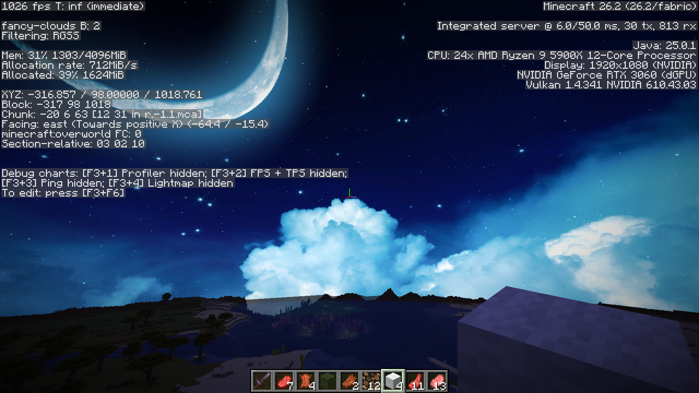
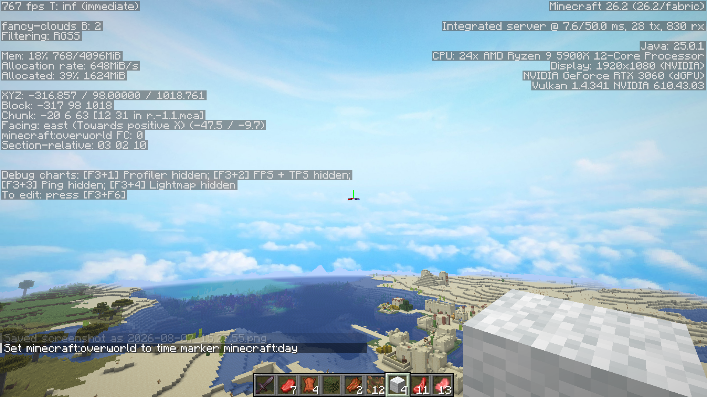
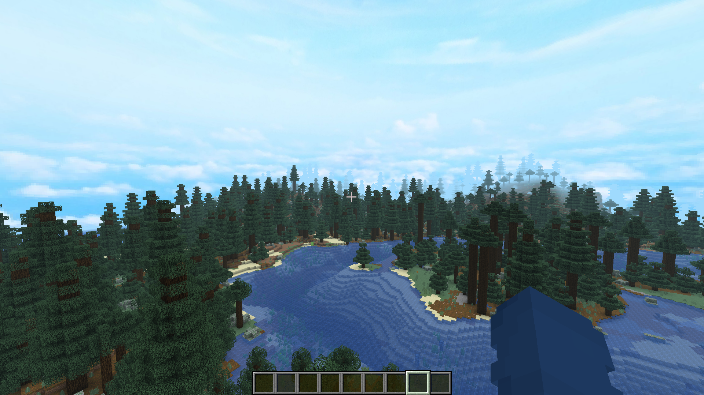
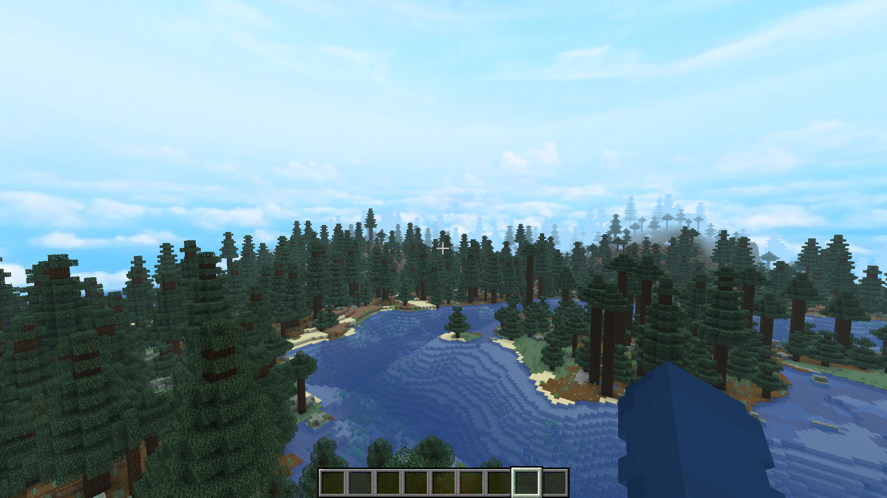
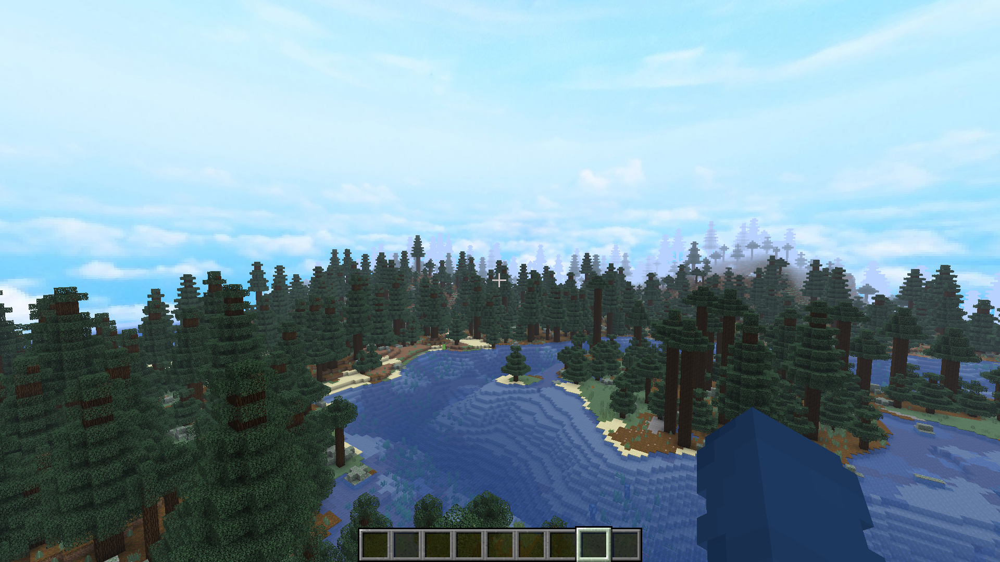

# Legacy Custom Sky

> [!WARNING]
> This mod's code was written entirely by AI, with the
> exception of the parts adapted from MCPatcher's "Better Skies" mod (MIT-licensed), credited
> below.

A Fabric mod for Minecraft that reimplements MCPatcher's "Better Skies" custom skybox feature
(the resource pack format also known as OptiFine's "Custom Sky"). Resource packs can define
one or more skybox layers per dimension, each with its own texture, fade-in/out schedule,
blend mode, and rotation.

## Screenshots




## Fog Blending

Vanilla fog fades distant chunks to the dimension's own flat color, which looks out of place
once a resource pack has replaced the sky above it. The **Fog Blending** setting (mod
settings screen, via Mod Menu) instead fades distant fog toward the active custom sky, with
three modes trading accuracy for performance:

| Screenshot | Mode | Description |
| --- | --- | --- |
|  | **Per-Pixel** (default) | Terrain fog samples the actual custom sky per-pixel, so it matches what's really behind it in every direction. Most accurate; adds a small cost only where fog is actually visible on screen. |
|  | **Directional** | Fog fades toward a single color per frame, sampled from the custom sky in the direction the camera is facing. Cheaper than Per-Pixel, but the whole screen shares one flat fog color, which can look off with more detailed skies. |
|  | **Vanilla** | Fog ignores the custom sky entirely and behaves exactly like unmodded Minecraft. No performance cost. |

## Requirements

- Minecraft 26.2
- Fabric Loader 0.19.3+
- Fabric API

## Building

```
./gradlew build
```

## Running in a dev environment

```
./gradlew runClient
```

## Resource pack format

Layers are defined by `sky<i>.properties` files, one per layer, discovered under either:

- `assets/<namespace>/mcpatcher/sky/world<N>/sky<i>.properties` (the original MCPatcher
  layout; `world0` = Overworld, `world1` = the End)
- `assets/<namespace>/skies/<dimension namespace>/<dimension path>/sky<i>.properties` (addresses
  any dimension by its own identifier)

Each properties file supports `source`, `startFadeIn`/`endFadeIn`/`endFadeOut`, `blend`,
`rotate`/`speed`/`axis`. See `CustomSkyLayer.java` for the exact parsing rules.

## License

This project's own code is available under the MIT license (see `LICENSE`).

### Third-party attribution

The Custom Sky layer format (`sky<i>.properties`), the fade-brightness curve math, the
`source=` path-resolution rules, the rotation-axis convention, and the nine `blend=` modes
implemented in `dev.oery.legacycustomsky.client.customsky` are adapted from **MCPatcher's
"Better Skies" mod** (`com.prupe.mcpatcher.sky.SkyRenderer`,
`com.prupe.mcpatcher.mal.resource.BlendMethod`), <https://bitbucket.org/prupe/mcpatcher>.

MCPatcher is distributed under the MIT License:

```
Copyright (c) 2013

Permission is hereby granted, free of charge, to any person obtaining a copy of
this software and associated documentation files (the "Software"), to deal in
the Software without restriction, including without limitation the rights to
use, copy, modify, merge, publish, distribute, sublicense, and/or sell copies
of the Software, and to permit persons to whom the Software is furnished to do
so, subject to the following conditions:

The above copyright notice and this permission notice shall be included in all
copies or substantial portions of the Software.

THE SOFTWARE IS PROVIDED "AS IS", WITHOUT WARRANTY OF ANY KIND, EXPRESS OR
IMPLIED, INCLUDING BUT NOT LIMITED TO THE WARRANTIES OF MERCHANTABILITY,
FITNESS FOR A PARTICULAR PURPOSE AND NONINFRINGEMENT. IN NO EVENT SHALL THE
AUTHORS OR COPYRIGHT HOLDERS BE LIABLE FOR ANY CLAIM, DAMAGES OR OTHER
LIABILITY, WHETHER IN AN ACTION OF CONTRACT, TORT OR OTHERWISE, ARISING FROM,
OUT OF OR IN CONNECTION WITH THE SOFTWARE OR THE USE OR OTHER DEALINGS IN THE
SOFTWARE.
```
